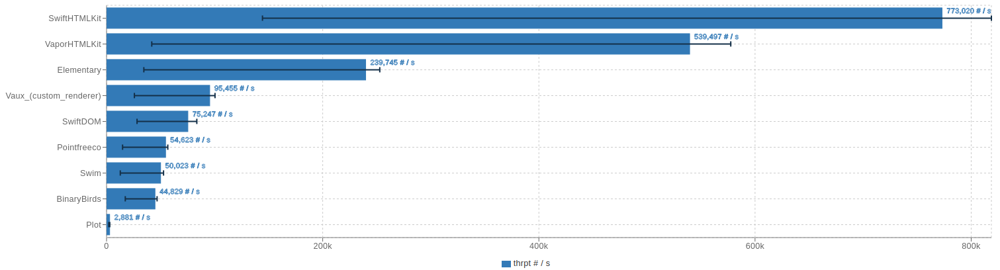

Write HTML using Swift Macros. Supports HTMX via global attributes.

<a href="https://swift.org"></a>  <a href="https://discord.com/invite/VyuFQUpcUz"></a> <a href="https://github.com/RandomHashTags/swift-htmlkit/blob/main/LICENSE"></a>

## Table of Contents

- [Why](#why)
- [Usage](#usage)
  - [Basic](#basic)
  - [Advanced](#advanced)
  - [HTMX](#htmx)
- [Benchmarks](#benchmarks)
  - [Static](#static)
  - [Dynamic](#dynamic)
  - [Conclusion](#conclusion)
- [Contributing](#contributing)

## Why
- Swift Macros are powerful, efficient and removes any runtime overhead (dynamic HTML requires runtime)
- Alternative libraries may not fit all situations and may restrict how the html is generated, manipulated, or cost a constant performance overhead (middleware, rendering, result builders, etc)
- HTML macros enforce safety, can be used anywhere, and compile directly to strings by default
- The output is minified at no performance cost

## Usage

### Basic

<details>
<summary>How do I use this library?</summary>

Use the `#html(encoding:lookupFiles:innerHTML:)` macro. All parameters, for the macro and default HTML elements, are optional by default. The default HTML elements are generated by an internal macro.

#### Macros

<details>
<summary>html</summary>

Requires explicit type annotation due to returning the inferred concrete type.

```swift

#html<T: CustomStringConvertible>(
  encoding: HTMLEncoding = .string,
  lookupFiles: [StaticString] = [],
  _ innerHTML: CustomStringConvertible & Sendable...
) -> T

```

</details>

<details>

<summary>anyHTML</summary>

Same as `#html` but returning an existential.

```swift

#anyHTML(
  encoding: HTMLEncoding = .string,
  lookupFiles: [StaticString] = [],
  _ innerHTML: CustomStringConvertible & Sendable...
)

```

</details>

#### HTMLElement

All default HTML elements conform to the `HTMLElement` protocol and contain their appropriate element attributes. They can be declared when you initialize the element or be changed after initialization by accessing the attribute variable directly.

The default initializer for creating an HTML Element follows this syntax:

```swift

<html element name>(
  attributes: [<global attribute>] = [],
  <element specific attribute>: <value>? = nil,
  _ innerHTML: CustomStringConvertible & Sendable...
)

```

#### Examples

```swift
// <div class="dark"><p>Macros are beautiful</p></div>
#html(
  div(attributes: [.class(["dark"])],
    p("Macros are beautiful")
  )
)

// <a href="https://github.com/RandomHashTags/litleagues" target="_blank"></a>
#html(
  a(href: "https://github.com/RandomHashTags/litleagues", target: ._blank)
)

// <input id="funny-number" max="420" min="69" name="funny_number" step="1" type="number" value="69">
#html(
  input(
    attributes: [.id("funny-number")],
    max: 420,
    min: 69,
    name: "funny_number",
    step: 1,
    type: .number,
    value: "69"
  )
)

// html example
let test:String = #html(
  html(
    body(
        div(
            attributes: [
                .class(["dark-mode", "row"]),
                .draggable(.false),
                .hidden(.true),
                .inputmode(.email),
                .title("Hey, you're pretty cool")
            ],
            "Random text",
            div(),
            a(
                div(
                    abbr()
                ),
                address()
            ),
            div(),
            button(disabled: true),
            video(autoplay: true, controls: false, preload: .auto, src: "https://github.com/RandomHashTags/litleagues", width: .centimeters(1)),
        )
    )
  )
)
```
</details>

<details>
<summary>How do I escape HTML?</summary>

The compiled output automatically escapes source breaking html characters **known only at compile time**.


You can also use the `#escapeHTML(innerHTML:)` macro to escape data known at compile time.

If you're working with **runtime** data:

- `<string>.escapeHTML(escapeAttributes:)`
  - mutates `self` escaping HTML and, optionally, attribute characters
- `<string>.escapeHTMLAttributes()`
  - mutates `self` escaping only attribute characters
- `<string>.escapingHTML(escapeAttributes:)`
  - returns a copy of `self` escaping HTML and, optionally, attribute characters
- `<string>.escapingHTMLAttributes()`
  - returns a copy of `self` escaping only attribute characters

</details>

<details>
<summary>How do I encode variables?</summary>

Using String Interpolation.

> You will get a compiler warning saying *interpolation may introduce raw HTML*.
> 
> Its up to you whether or not to suppress this warning or escape the HTML at runtime using a method described above.
> 
> Swift HTMLKit tries to [promote](https://github.com/RandomHashTags/swift-htmlkit/blob/94793984763308ef5275dd9f71ea0b5e83fea417/Sources/HTMLKitMacros/HTMLElement.swift#L423) known interpolation at compile time with an equivalent `StaticString` for the best performance. It is currently limited due to macro expansions being sandboxed and lexical contexts/AST not being available for the macro argument types. This means referencing content in an html macro won't get promoted to its expected value. [Read more about this limitation](https://forums.swift.org/t/swift-lexical-lookup-for-referenced-stuff-located-outside-scope-current-file/75776/6).

#### Example

```swift
let string:String = "any string value", integer:Int = -69, float:Float = 3.141592

// ✅ DO
let _:String = #html(p("\(string); \(integer); \(float)"))
let _:String = #html(p("\(string)", "; ", String(describing: integer), "; ", float.description))

let integer_string:String = String(describing: integer), float_string:String = String(describing: float)
let _:String = #html(p(string, "; ", integer_string, "; ", float_string))

// ❌ DON'T; compiler error; compile time value cannot contain interpolation
let _:StaticString = #html(p("\(string); \(integer); \(float)"))
let _:StaticString = #html(p("\(string)", "; ", String(describing: integer), "; ", float.description))
let _:StaticString = #html(p(string, "; ", integer_string, "; ", float_string))

```

</details>

### Advanced

<details>
<summary>I need a custom element!</summary>

Use the default `custom(tag:isVoid:attributes:innerHTML:)` html element.

#### Example

We want to show the [Apple Pay button](https://developer.apple.com/documentation/apple_pay_on_the_web/displaying_apple_pay_buttons_using_javascript#3783424):
```swift
#html(
  custom(
    tag: "apple-pay-button",
    isVoid: false,
    attributes: [
      .custom("buttonstyle", "black"),
      .custom("type", "buy"),
      .custom("locale", "el-GR")
    ]
  )
)
```
becomes
```html
<apple-pay-button buttonstyle="black" type="buy" locale="el-GR"></apple-pay-button>
```

</details>

<details>
<summary>I need a custom attribute!</summary>

Use the `.custom(id:value:)` global attribute.

#### Example

We want to show the [Apple Pay button](https://developer.apple.com/documentation/apple_pay_on_the_web/displaying_apple_pay_buttons_using_javascript#3783424):
```swift
#html(
  custom(
    tag: "apple-pay-button",
    isVoid: false,
    attributes: [
      .custom("buttonstyle", "black"),
      .custom("type", "buy"),
      .custom("locale", "el-GR")
    ]
  )
)
```
becomes
```html
<apple-pay-button buttonstyle="black" type="buy" locale="el-GR"></apple-pay-button>
```

</details>

<details>
<summary>I need to listen for events!</summary>

> <strong>WARNING</strong>
>
> Inline event handlers are an outdated way to handle events.
>
> General consensus considers this \"bad practice\" and you shouldn't mix your HTML and JavaScript.
>
> This remains deprecated to encourage use of other techniques.
>
> Learn more at https://developer.mozilla.org/en-US/docs/Learn/JavaScript/Building_blocks/Events#inline_event_handlers_—_dont_use_these.

Use the `.event(<event type>, "<value>")` global attribute.

#### Example

```swift
#html(
  div(
    attributes: [
      .event(.click, "doThing()"),
      .event(.change, "doAnotherThing()")
    ]
  )
)
```
</details>

<details>
<summary>I need the output as a different type!</summary>

Declare the encoding you want in the `#html` macro.

```swift

#html(
  encoding: HTMLEncoding = .<type>
)

```

[Currently supported types](https://github.com/RandomHashTags/swift-htmlkit/blob/main/Sources/HTMLKitUtilities/HTMLEncoding.swift):
- `string` -> `String`/`StaticString`
- `utf8Bytes` -> An array of `UInt8` (supports any collection `where Element == UInt8`)
- `utf16Bytes` -> An array of `UInt16` (supports any collection `where Element == UInt16`)
- `utf8CString` -> `ContiguousArray<CChar>`
- `foundationData` -> `Foundation.Data`/`FoundationEssentials.Data`
  - You need to `import Foundation` or `import FoundationEssentials` to use this!
- `byteBuffer` -> `NIOCore.ByteBuffer`
  - You need to `import NIOCore` to use this! Swift HTMLKit does not depend on `swift-nio`!
- `custom("<encoding logic>")` -> A custom type conforming to `CustomStringConvertible`
  - Use `$0` to reference the compiled HTML (as a String without the delimiters)

</details>

<details>

<summary>I need to use raw HTML!</summary>

Use the `#rawHTML(encoding:lookupFiles:innerHTML:)` and `#anyRawHTML(encoding:lookupFiles:innerHTML:)` macros.

#### Examples

```swift

var expected = "<!DOCTYPE html><html>dude&dude</html>"
var result:String = #rawHTML("<!DOCTYPE html><html>dude&dude</html>")
#expect(expected == result)

expected = "<!DOCTYPE html><html><p>test&lt;&gt;</p>dude&dude bro&amp;bro</html>"
result = #html(html(#anyRawHTML(p("test<>"), "dude&dude"), " bro&bro"))
#expect(expected == result)

```

</details>

### HTMX

<details>

<summary>How do I use HTMX?</summary>

Use the `.htmx(<htmx attribute>)` global attribute. All HTMX 2.0 attributes are supported (including Server Sent Events & Web Sockets).

#### Examples

```swift

// <div hx-boost="true"></div>
var string:StaticString = #html(div(attributes: [.htmx(.boost(.true))]))

// <div hx-get="/test"></div>
string = #html(div(attributes: [.htmx(.get("/test"))]))

// <div hx-on::abort="bruh()"></div>
string = #html(div(attributes: [.htmx(.on(.abort, "bruh()"))]))

// <div hx-on::after-on-load="test()"></div>
string = #html(div(attributes: [.htmx(.on(.afterOnLoad, "test()"))]))

// <div hx-on:click="thing()"></div>
string = #html(div(attributes: [.htmx(.onevent(.click, "thing()"))]))

// <div hx-preserve></div>
string = #html(div(attributes: [.htmx(.preserve(true))]))

// <div sse-connect="/connect"></div>
string = #html(div(attributes: [.htmx(.sse(.connect("/connect")))]))

// <div ws-connect="/chatroom"></div>
string = #html(div(attributes: [.htmx(.ws(.connect("/chatroom")))]))

// <div hx-ext="ws" ws-send></div>
string = #html(div(attributes: [.htmx(.ext("ws")), .htmx(.ws(.send(true)))]))

```

</details>


## Benchmarks

- Libraries tested
  - [BinaryBuilds/swift-html](https://github.com/BinaryBirds/swift-html) v1.7.0 (patched version [here](https://github.com/RandomHashTags/fork-bb-swift-html))
  - [sliemeobn/elementary](https://github.com/sliemeobn/elementary) v0.4.1
  - [JohnSundell/Plot](https://github.com/JohnSundell/Plot) v0.14.0
  - [tayloraswift/swift-dom](https://github.com/tayloraswift/swift-dom) v1.1.0 (patched version [here](https://github.com/RandomHashTags/fork-swift-dom))
  - [RandomHashTags/swift-htmlkit](https://github.com/RandomHashTags/swift-htmlkit) v0.10.0 (this library)
  - [pointfreeco/swift-html](https://github.com/pointfreeco/swift-html) v0.4.1
  - [robb/Swim](https://github.com/robb/Swim) v0.4.0
  - [vapor-community/HTMLKit](https://github.com/vapor-community/HTMLKit) v2.8.1
  - [dokun1/Vaux](https://github.com/dokun1/Vaux) v0.2.0 (patched version [here](https://github.com/RandomHashTags/fork-Vaux); custom renderer [here](https://github.com/RandomHashTags/swift-htmlkit/blob/main/Benchmarks/Benchmarks/Vaux/Vaux.swift))

Test machine:
- CPU: 7800x3D
- RAM: 32GB DDR5
- Storage: 1TB NVME (661.2 GiB free space)
- OS: Arch Linux 6.11.9-arch1-1
- Swift: 6.0.2, Swift 6 compiler

Benchmark command: `swift package --allow-writing-to-package-directory benchmark --target Benchmarks --metric throughput --format jmh`

### Static


### Dynamic



### Conclusion

This library is the clear leader in performance & efficiency. Static webpages offer the best performance, while dynamic pages still tops the charts (I am actively researching and testing improvements for dynamic pages).

## Contributing

Contributions are always welcome. See [CONTRIBUTIONS.md](https://github.com/RandomHashTags/swift-htmlkit/blob/main/CONTRIBUTING.md) for best practices.