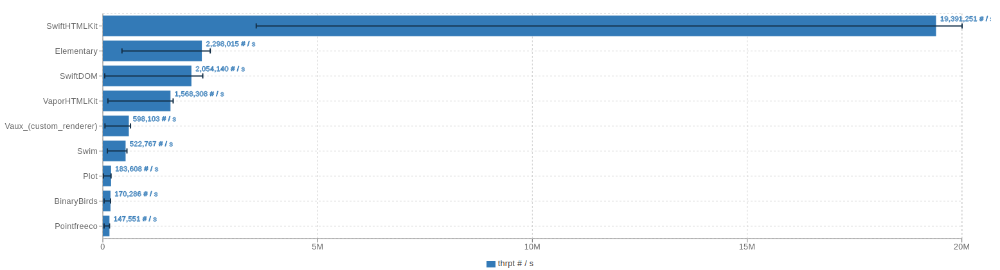

Write HTML using Swift Macros.

<a href="https://swift.org"></a>  <a href="https://github.com/RandomHashTags/swift-htmlkit/blob/main/LICENSE">

- [Why](#why)
- [Examples](#examples)
  - [Basic](#basic)
  - [Advanced](#advanced)
- [Benchmarks](#benchmarks)
  - [Static](#static)
  - [Dynamic](#dynamic)
  - [Conclusion](#conclusion)
- [Contributing](#contributing)
- [Funding](#funding)

## Why
- Swift Macros are powerful, efficient and essentially removes any runtime overhead
- Alternative libraries may not fit all situations and may restrict how the html is generated, manipulated, prone to human error, or cost a constant performance overhead (middleware, rendering, result builders, etc)
- HTML macros enforce safety, can be used anywhere, and compile directly to strings
- The output is minified at no performance cost
## Examples
### Basic
<details>
<summary>How do I use this library?</summary>

Syntax: `#<html element>(attributes: [], <element specific attributes>: V?, _ innerHTML: [ExpressibleByStringLiteral])`
#### Examples

```swift
// <div class="dark"><p>Macros are beautiful</p></div>
#div(attributes: [.class(["dark"])], [
    #p(["Macros are beautiful"])
])

// <a href="https://github.com/RandomHashTags/litleagues" target="_blank"></a>
#a(href: "https://github.com/RandomHashTags/litleagues", target: ._blank)

// <input id="funny-number" max="420" min="69" name="funny_number" step="1" type="number" value="69">
#input(
    attributes: [.id("funny-number")],
    max: 420,
    min: 69,
    name: "funny_number",
    step: 1,
    type: .number,
    value: "69"
)

// html example
let test:String = #html([
    #body([
        #div(
            attributes: [
                .class(["dark-mode", "row"]),
                .draggable(.false),
                .hidden(.true),
                .inputmode(.email),
                .title("Hey, you're pretty cool")
            ],
            [
                "Random text",
                #div(),
                #a([
                    #div([
                        #abbr()
                    ]),
                    #address()
                ]),
                #div(),
                #button(disabled: true),
                #video(autoplay: true, controls: false, preload: .auto, src: "https://github.com/RandomHashTags/litleagues", width: .centimeters(1)),
            ]
        )
    ])
])
```
</details>

<details>
<summary>How do I encode variables?</summary>
Using String Interpolation.

#### Example
```swift
let string:String = "any string value", integer:Int = -69, float:Float = 3.14159

// ✅ DO
let _:String = #p(["\(string); \(integer); \(float)"])

// ❌ DON'T
let _:String = #p([string, "; ", String(describing: integer), "; ", float.description])
```

</details>

### Advanced
<details>
<summary>I need a custom element!</summary>

Use the `#custom(tag:isVoid:attributes:innerHTML:)` macro.
#### Example
We want to show the [Apple Pay button](https://developer.apple.com/documentation/apple_pay_on_the_web/displaying_apple_pay_buttons_using_javascript#3783424):
```swift
#custom(tag: "apple-pay-button", isVoid: false, attributes: [.custom("buttonstyle", "black"), .custom("type", "buy"), .custom("locale", "el-GR")])
```
becomes
```html
<apple-pay-button buttonstyle="black" type="buy" locale="el-GR"></apple-pay-button>
```

</details>

<details>
<summary>I need a custom attribute!</summary>

Use `HTMLElementAttribute.custom(id:value:)`
#### Example
We want to show the [Apple Pay button](https://developer.apple.com/documentation/apple_pay_on_the_web/displaying_apple_pay_buttons_using_javascript#3783424):
```swift
#custom(tag: "apple-pay-button", isVoid: false, attributes: [.custom("buttonstyle", "black"), .custom("type", "buy"), .custom("locale", "el-GR")])
```
becomes
```html
<apple-pay-button buttonstyle="black" type="buy" locale="el-GR"></apple-pay-button>
```

</details>

<details>
<summary>I need to listen for events!</summary>

> <strong>WARNING</strong>
>
> Inline event handlers are an outdated way to handle events.
>
> General consensus considers this \"bad practice\" and you shouldn't mix your HTML and JavaScript.
>
> This remains deprecated to encourage use of other techniques.
>
> Learn more at https://developer.mozilla.org/en-US/docs/Learn/JavaScript/Building_blocks/Events#inline_event_handlers_—_dont_use_these.

Use the `HTMLElementAttribute.event(<type>, "<value>")`.
#### Example
```swift
#div(attributes: [.event(.click, "doThing()"), .event(.change, "doAnotherThing()")])
```
</details>

## Benchmarks
- Libraries tested
  - [BinaryBuilds/swift-html](https://github.com/BinaryBirds/swift-html) v1.7.0 (patched version [here](https://github.com/RandomHashTags/fork-bb-swift-html))
  - [sliemeobn/elementary](https://github.com/sliemeobn/elementary) v0.3.4
  - [JohnSundell/Plot](https://github.com/JohnSundell/Plot) v0.14.0
  - [RandomHashTags/swift-htmlkit](https://github.com/RandomHashTags/swift-htmlkit) v0.5.0 (this library)
  - [pointfreeco/swift-html](https://github.com/pointfreeco/swift-html) v0.4.1
  - [robb/Swim](https://github.com/robb/Swim) v0.4.0 (patched version [here](https://github.com/RandomHashTags/fork-Swim))
  - [vapor-community/HTMLKit](https://github.com/vapor-community/HTMLKit) v2.8.1
  - [dokun1/Vaux](https://github.com/dokun1/Vaux) v0.2.0 (patched version [here](https://github.com/RandomHashTags/fork-Vaux))

Using iMac (i9 9900k, 72GB RAM, 2TB) with macOS 15.0 and the Swift 6 compiler.

Executed command: `swift package -c release --allow-writing-to-package-directory benchmark --metric throughput  --format jmh`

### Static


### Dynamic


### Conclusion
This library is the clear leader in performance & efficiency. Static webpages offer the best performance, while dynamic pages still tops the charts (I am actively researching and testing improvements for dynamic pages).

## Contributing
Create a PR.

## Funding
Love this library? Consider supporting this project by sponsoring the developers.
- [RandomHashTags](https://github.com/sponsors/RandomHashTags)